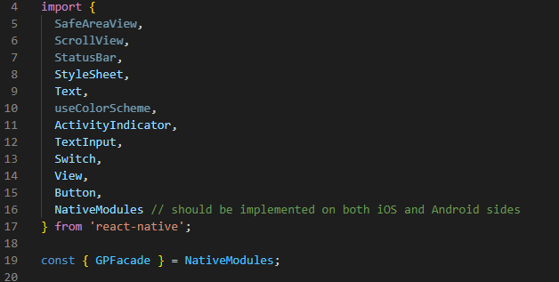

# React Native

:::note
Latest GlobalPass Android SDK version: **1.2.7**
:::

## 1. Connect GlobalPass SDK

### a. Add this code to the Project level _build.gradle_ file under `allprojects -> repositories` section:

```gradle title="build.gradle"
/* GlobalPass SDK Maven Repository */
maven {
    url 'https://pkgs.dev.azure.com/isun-ag/GlobalPassApp-Public/_packaging/GlobalPassAndroidSDK/maven/v1'
}

/* FaceTec SDK Maven Private Repository */
maven {
    url 'https://pkgs.dev.azure.com/isun-ag/GlobalPassApp/_packaging/facetecandroid/maven/v1'
    name 'facetecandroid'
    credentials {
        username "isun-ag"
        password "<token>"
    }
}
```

:::info
To get a <token\> value used above, please contact **GlobalPass** support.
:::

### b. Add this code to the App level _build.gradle_ file under `dependencies`:

```gradle title="build.gradle"
implementation 'ch.globalpass.sdk:release:1.2.7'
```

### c. Sync gradle

:::tip

If you use **ProGuard** in your project to avoid crashes and bugs you should use next rules:

```
-keep class ch.globalpass.globalpasssdk.api.* { public *;}
-keep class com.facetec.sdk.*{*;}
```

:::

## 2. Create Native module to communicate with React Native

Official documentation: [https://reactnative.dev/docs/native-modules-android#module-name](https://reactnative.dev/docs/native-modules-android#module-name)

### a. Create interface with functions you need in your module e.g.:

```kotlin
interface GPFacade {

  @ReactMethod
  fun buildKYCProd(token: String, promise: Promise)

  @ReactMethod
  fun buildKYCDev(token: String, promise: Promise)

  @ReactMethod
  fun buildIBProd(token: String, promise: Promise)

  @ReactMethod
  fun buildIBDev(token: String, promise: Promise)

}
```

### b. Create an implementation of your interface. Also you need to extend

```kotlin
class GlobalPassSDKManager(
    reactContext: ReactApplicationContext,
) : ReactContextBaseJavaModule(reactContext), GPFacade {

    @ReactMethod
    override fun buildKYCProd(token: String, promise: Promise) {
        try {
            GlobalPassSDK
                .create(requireNotNull(currentActivity))
                .start(
                    token = token,
                    activity = currentActivity!!::class.java,
                    environment = GlobalPassEnvironment.Prod
                )

            promise.resolve(token)
        } catch (e: Exception) {
            promise.reject(e)
        }
    }

    @ReactMethod
    override fun buildKYCDev(token: String, promise: Promise) {
        try {
            GlobalPassSDK
                .create(requireNotNull(currentActivity))
                .start(
                    token = token,
                    activity = currentActivity!!::class.java,
                    environment = GlobalPassEnvironment.Dev
                )
            promise.resolve(token)
        } catch (e: Exception) {
            promise.reject(e)
        }
    }

    override fun buildIBProd(biometricsId: String, promise: Promise) {
        try {
            GlobalPassSDK
                .create(requireNotNull(currentActivity))
                .start(
                    token = biometricsId,
                    activity = currentActivity!!::class.java,
                    environment = GlobalPassEnvironment.Prod,
                    flow = GlobalPassFlow.InstantBiometrics
                )
            promise.resolve(biometricsId)
        } catch (e: Exception) {
            promise.reject(e)
        }
    }

    override fun buildIBDev(biometricsId: String, promise: Promise) {
        try {
            GlobalPassSDK
                .create(requireNotNull(currentActivity))
                .start(
                    token = biometricsId,
                    activity = currentActivity!!::class.java,
                    environment = GlobalPassEnvironment.Dev,
                    flow = GlobalPassFlow.InstantBiometrics
                )
            promise.resolve(biometricsId)
        } catch (e: Exception) {
            promise.reject(e)
        }
    }

    override fun getName(): String = "GPFacade"
}
```

### c. Implement ReactPackage interface:

```java
public class GlobalPassPackage implements ReactPackage {

 @NonNull
 @Override
 public List<ViewManager> createViewManagers(@NonNull ReactApplicationContext reactContext) {
     return Collections.emptyList();
 }

 @NonNull
 @Override
 public List<NativeModule> createNativeModules(
         @NonNull ReactApplicationContext reactContext) {
     List<NativeModule> modules = new ArrayList<>();
     modules.add(new GlobalPassSDKManager(reactContext));
     return modules;
 }
}
```

### d. Add your Package class to MainApplication.java -> getPackages()

```java
packages.add(new GlobalPassPackage ());
```

## 3. Connect your module with React Native:

Define in App.js your modules:



## 4. Start KYC flow

You can start KYC process by calling one of the functions.

```jsx
GPFacade.buildKYCDev(screeningToken);
GPFacade.buildKYCProd(screeningToken);
```

## 5. Start Instant Biometrics flow

```jsx
GPFacade.buildIBProd(screeningToken);
GPFacade.buildIBDev(screeningToken);
```

## 6. Additional optional parameters in `start()` function:

There are additional optional parameters in `start()` function:

| Parameter        | Description                                                 |
| ---------------- | ----------------------------------------------------------- |
| enableFileLogger | Enable Logger to write SDK logs.                            |
| widgetMode       | Select matching widget mode if `Split` flow is used.        |
| externalId       | Specify your internal customer identifier to be set on the screening. |
| languageCode     | Specify SDK language using available langauage options.   |

```kotlin
globalPassSdk.start(
    // ...
    enableFileLogger = true,
    widgetMode: WidgetMode = WidgetMode.FULL_MODE,
    externalId: String? = null,
    languageCode: String = "en"
)
```

### `enableFileLogger`

There is an optional Logger that writes logs into file which could be found in Internal Storage:

`File Storage → Android → data → “your app package” → files → logs → logs file`

It is optional and `false` by default. To enable the logger you need to set it to `true`.

### `widgetMode`

To use **Split** flow, matching widgetMode must be selected. By default it is set to `FULL_MODE`. To select mode you can use sealed class WidgetMode

```kotlin
enum class WidgetMode(val value: String?) {
    SPLIT_IDENTITY_MODE(value = "Identity"),
    SPLIT_ADDRESS_MODE(value = "Address"),
    FULL_MODE(value = null)
}
```

### `externalId`

You can provide your own customer ID to be assigned to the screening flow. By default value is `null`.


### `languageCode`

By default, the SDK is displayed in English. To specify a different SDK display language, you can provide the locale code here.

Available locales:
- English (`en`)
- German (`de`)
- Russian (`ru`)
- Chinese Simplified (`zh-CN`)
- Lithuanian (`lt`)

:::note
If an unsupported locale will be provided, the SDK will fallback to English.
:::