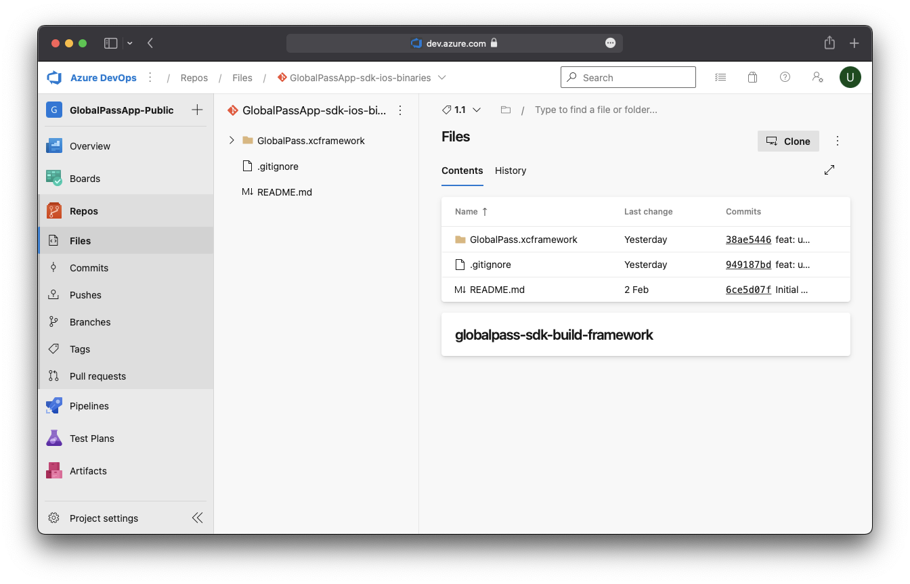

# React Native

## 1. Manual installation step-by-step

:::tip
You can follow the manual installation steps below or use CocoaPods to install dependences. For the latter, see [CocoaPods installation step-by-step](#cocoapods-installation-step-by-step).
:::

### a. Clone the repository

[https://isun-ag@dev.azure.com/isun-ag/GlobalPassApp-Public/_git/GlobalPassApp-sdk-ios-binaries](https://isun-ag@dev.azure.com/isun-ag/GlobalPassApp-Public/_git/GlobalPassApp-sdk-ios-binaries)

The cloned repository contains `GlobalPass.xcframework` folder which should be copied to **React Native** project's `ios` folder. See the example below:



### b. Open React Native project's iOS .xcworkspace file


### c. Open context menu on Frameworks folder and select `Add files to …`


### d. Choose the `GlobalPass.xcframework` folder and click `Add`


### e. You can now build the project

## 2. CocoaPods installation step-by-step

### a. Edit Podfile

Add plugin to the beginning of Podfile:

```ruby
plugin 'cocoapods-azure-universal-packages', {
  :organization => 'https://dev.azure.com/isun-ag'
}
```

Provide `source` urls:

```ruby
source 'https://cdn.cocoapods.org'
source 'https://dev.azure.com/isun-ag/GlobalPassApp-Public/_git/GlobalPassApp-sdk-ios-private-specs'
```

and required dependencies:

```ruby
pod 'GlobalPass', '~> 1.6'
pod 'FaceTecSDK', :http => 'https://dev.azure.com/isun-ag/368936e7-5cb5-4092-96c5-fe9942e2c3e1/_apis/packaging/feeds/FaceTecSDK/upack/packages/facetecsdk/versions/0.0.2'
```

### b. Install Cocoa Pods in Terminal

Run the following commands:

```bash
$ brew update && brew install azure-cli
```

```bash
$ az devops login
```

:::info
When asked for credentials, put the **repository access token** you were provided by GlobalPass.
:::

```bash
$ gem install cocoapods-azure-universal-packages
```

```bash
$ pod install
```

## 3. Project setup

### Paste the following lines to `Info.plist`

```xml title="Info.plist"
<key>NFCReaderUsageDescription</key>
<string>Provide you description here</string>
<key>NSCameraUsageDescription</key>
<string>Provide you description here</string>
<key>NSLocationWhenInUseUsageDescription</key>
<string>Provide you description here</string>
<key>com.apple.developer.nfc.readersession.iso7816.select-identifiers</key>
<array>
<string>A0000002471001</string>
<string>00000000000000</string>
</array>
```

:::caution important
Please change the descriptions under `NFCReaderUsageDescription`, `NSCameraUsageDescription` and `NSLocationWhenInUseUsageDescription` in the file above. This is important to pass **App Store** review process for your application.
:::

## Usage

### React side

There is a type named `GPFacade`


This type has methods that provide flows and environments to interact with GlobalPass:

- `buildKYCDev` - takes a screening token and runs screening flow in dev environment
- `buildKYCProd` - takes a screening token and runs screening flow in prod environment
- `buildIBDev` - takes an instant biometrics ID and runs instant biometrics flow in dev environment
- `buildIBProd` - takes an instant biometrics ID and runs instant biometrics flow in prod environment


### iOS side

Methods above are represented in Objective-C by following signatures:

```objectivec
RCT_EXPORT_METHOD(buildKYCDev:(NSString *)screeningToken 
                  resolver:(RCTPromiseResolveBlock)resolve
                  rejecter:(RCTPromiseRejectBlock)reject) {
  NSError *error;
  
  VoidClosure callback = [GlobalPassSDK setupScreeningWithEnvironment:GlobalPassEnvironmentDev
                                                       screeningToken:screeningToken
                                                                error:&error];
  
  if (error != nil) {
    reject(@"0", @"GlobalPass", error);
    return;
  }
  
  dispatch_async(dispatch_get_main_queue(), ^{
    UIViewController *controller = [GlobalPassSDK startScreening];
    
    controller.modalPresentationStyle = UIModalPresentationOverFullScreen;
    [[[[[UIApplication sharedApplication] delegate] window] rootViewController] presentViewController:controller animated:YES completion:^{
      
    }];
  });
};

RCT_EXPORT_METHOD(buildKYCProd:(NSString *)screeningToken 
                  resolver:(RCTPromiseResolveBlock)resolve
                  rejecter:(RCTPromiseRejectBlock)reject) {
  NSError *error;
  VoidClosure callback = [GlobalPassSDK setupScreeningWithEnvironment:GlobalPassEnvironmentProd
                                                       screeningToken:screeningToken
                                                                error:&error];

  if (error != nil) {
    reject(@"0", @"GlobalPass", error);
    return;
  }
  
  dispatch_async(dispatch_get_main_queue(), ^{
    UIViewController *controller = [GlobalPassSDK startScreening];
    controller.modalPresentationStyle = UIModalPresentationOverFullScreen;
    [[[[[UIApplication sharedApplication] delegate] window] rootViewController] presentViewController:controller animated:YES completion:^{
      
    }];
  });
};

RCT_EXPORT_METHOD(buildIBDev:(NSString *)instantBiometricsID
                  resolver:(RCTPromiseResolveBlock)resolve
                  rejecter:(RCchTPromiseRejectBlock)reject) {
  NSError *error;
  VoidClosure callback = [GlobalPassSDK setupInstantWithEnvironment:GlobalPassEnvironmentDev
                                                instantBiometricsId:instantBiometricsID
                                                              error:&error];

  if (error != nil) {
    reject(@"0", @"GlobalPass", error);
    return;
  }
  
  dispatch_async(dispatch_get_main_queue(), ^{
    UIViewController *controller = [GlobalPassSDK startInstant];
    controller.modalPresentationStyle = UIModalPresentationOverFullScreen;
    [[[[[UIApplication sharedApplication] delegate] window] rootViewController] presentViewController:controller animated:YES completion:^{
      
    }];
  });
};

RCT_EXPORT_METHOD(buildIBProd:(NSString *)instantBiometricsID
                  resolver:(RCTPromiseResolveBlock)resolve
                  rejecter:(RCTPromiseRejectBlock)reject) {
  NSError *error;
  VoidClosure callback = [GlobalPassSDK setupInstantWithEnvironment:GlobalPassEnvironmentProd
                                                instantBiometricsId:instantBiometricsID
                                                              error:&error];

  if (error != nil) {
    reject(@"0", @"GlobalPass", error);
    return;
  }
  
  dispatch_async(dispatch_get_main_queue(), ^{
    UIViewController *controller = [GlobalPassSDK startInstant];
    controller.modalPresentationStyle = UIModalPresentationOverFullScreen;
    [[[[[UIApplication sharedApplication] delegate] window] rootViewController] presentViewController:controller animated:YES completion:^{
      
    }];
  });
};

RCT_EXPORT_METHOD(buildSplitKYCDev:(NSString *)screeningToken 
                  resolver:(RCTPromiseResolveBlock)resolve
                  rejecter:(RCTPromiseRejectBlock)reject) {
  NSError *error;
  
  VoidClosure callback = [GlobalPassSDK setupScreeningWithEnvironment:GlobalPassEnvironmentDev
                                                       screeningToken:screeningToken
                                                                error:&error];
  
  if (error != nil) {
    reject(@"0", @"GlobalPass", error);
    return;
  }
  
  dispatch_async(dispatch_get_main_queue(), ^{
    UIViewController *controller = [GlobalPassSDK startSplitScreeningWithType:GPSplitFlowAddress externalID:nil];
    
    controller.modalPresentationStyle = UIModalPresentationOverFullScreen;
    [[[[[UIApplication sharedApplication] delegate] window] rootViewController] presentViewController:controller animated:YES completion:^{
      
    }];
  });
};

RCT_EXPORT_METHOD(buildSplitKYCProd:(NSString *)screeningToken 
                  resolver:(RCTPromiseResolveBlock)resolve
                  rejecter:(RCTPromiseRejectBlock)reject) {
  NSError *error;
  VoidClosure callback = [GlobalPassSDK setupScreeningWithEnvironment:GlobalPassEnvironmentProd
                                                       screeningToken:screeningToken
                                                                error:&error];

  if (error != nil) {
    reject(@"0", @"GlobalPass", error);
    return;
  }
  
  dispatch_async(dispatch_get_main_queue(), ^{
    UIViewController *controller = [GlobalPassSDK startSplitScreeningWithType:GPSplitFlowAddress externalID:nil];
    controller.modalPresentationStyle = UIModalPresentationOverFullScreen;
    [[[[[UIApplication sharedApplication] delegate] window] rootViewController] presentViewController:controller animated:YES completion:^{
      
    }];
  });
};
```

Each of the calls to `GlobalPassSDK` facade that starts with `start` returns an instance of `UIViewController` that should be presented over a root view controller of a window.

Call to methods that start with `setup` returns an empty closure that should be called at the end of GlobalPass flow in order to clean up all the resources and indicate a finish.

Pass `externalID` to associate custom string with the KYC session.
